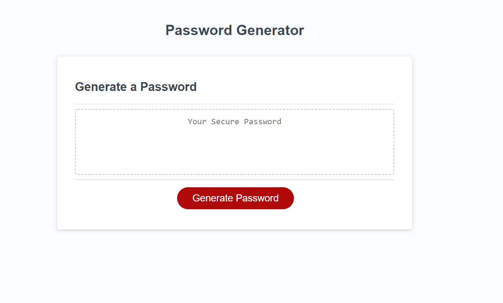
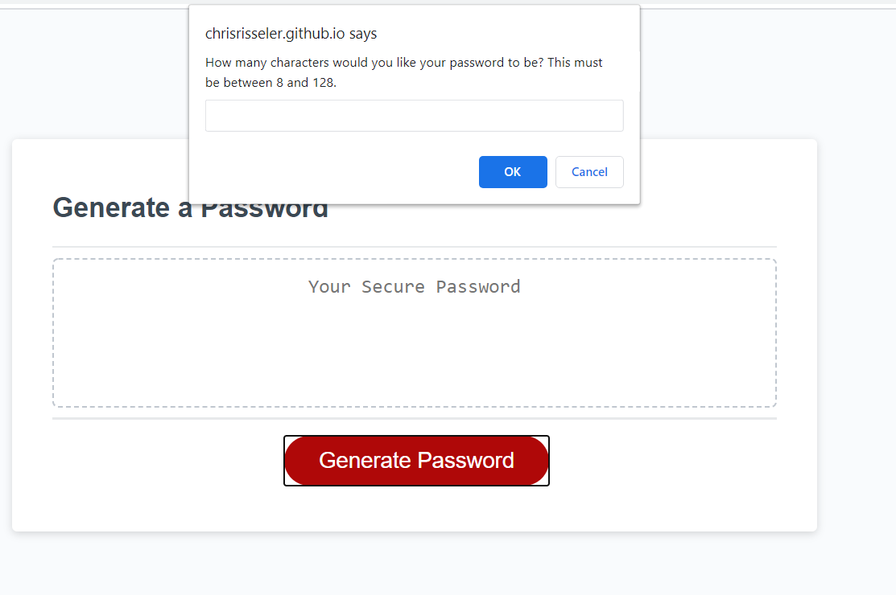
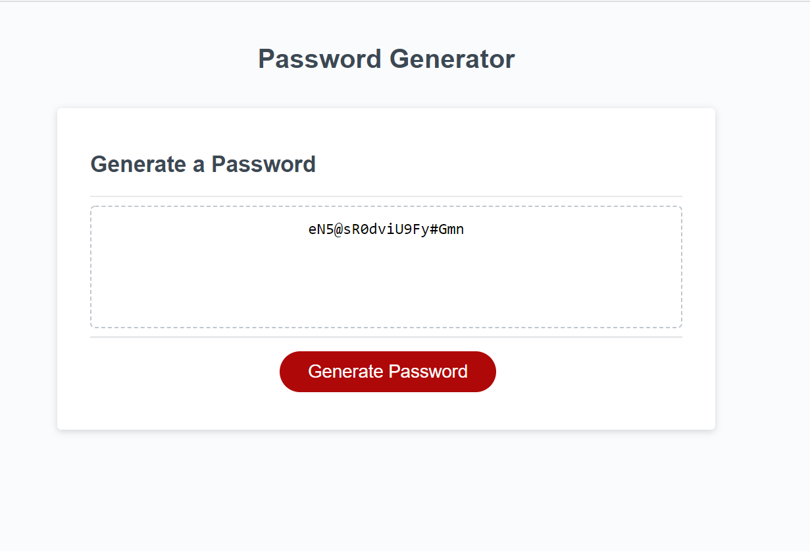

# Randomized Password Generator

Project name is a website that allows anybody to create a randomized password. This will help increase security when you need it. The passwords will be between 8 and 128 characters with a variety of upper case, lower case, and special characters, as well as numbers.

## Using Randomized Password Generator

To use the password generator, you have to click generate password, then select your criteria from a few prompts. This will then generate a randomized password for your security.

  

The options will be for lower case, upper case, special characters and numbers. You can also chose the number of characters in your password.

## Contributors

Thanks to the following people who have contributed to this project:

* Chris R.
* Alper G.
* Carl V.
* Joshua B.
* Tim A.

## Contact

If you want to contact me you can reach me at chrisrisseler43@gmail.com.

## License
<!--- If you're not sure which open license to use see https://choosealicense.com/--->

This project uses the following license: MIT Liscence Copywright (c) 2020 Chris Risseler <a href = "assets/license.md">License Here.</a>